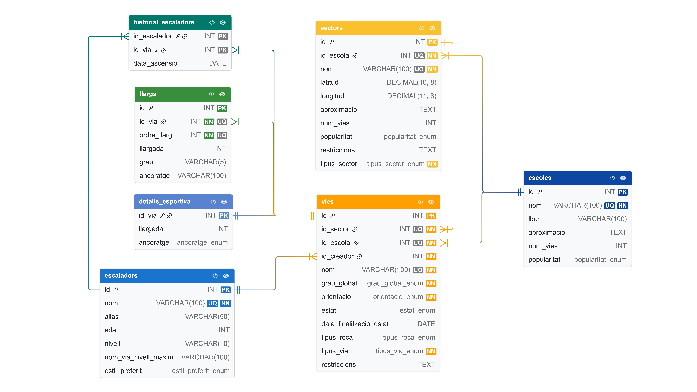

# Escalada-Persistencia

Aplicació de consola en Java per gestionar escoles, sectors, vies, escaladors i historial d'ascensions amb persistència MySQL (JDBC). El projecte implementa una arquitectura MVC + DAO + Abstract Factory.

Aquest document descriu l'arquitectura del sistema, les funcionalitats implementades i els requeriments de negoci coberts.

---

## Què hem construït

S'ha implementat un sistema complet de gestió amb les funcionalitats següents:
- CRUD complet per a les entitats: `Escola`, `Sector`, `Via` i `Escalador`.
- Registre i consulta d'ascensions mitjançant el mòdul `Historial`.
- Suport per a 3 tipus de via: `ESPORTIVA`, `CLASSICA`, `GEL`.
- Validació de regles de negoci (graus, estats i restriccions temporals).
- Consultes avançades sobre les vies.

---

## Arquitectura i Organització

### 1) `view/` - Capa de Presentació
S'encarrega de la interacció amb l'usuari per consola. Demana dades, neteja buffers i mostra resultats. No conté cap sentència SQL.
```java
public int mostrarMenuPrincipal() { ... }
```

### 2) `controller/` - Lògica de Control i Negoci

Orquestra la navegació, valida les regles de negoci abans de fer cap acció i delega la persistència a la capa DAO.

```java
if (!validarGrau(v.getGrauGlobal(), v.getEstil())) return;
```

### 3) `model/entidades/` - Domini

Objectes de negoci purs que representen el model de dades (`Via`, `Escola`, `Sector`, `Llarg`, etc.).

### 4) `model/dao/` + `model/dao/mysql/` - Persistència

Separació mitjançant interfícies DAO i la implementació específica per a MySQL. Totes les crides es fan a través d'una factoria abstracta.

```java
DAOFactory.obtenirDAOFactory(DAOFactory.MYSQL).obtenirViaDAO();
```

---

## Flux Principal d'Execució

A la classe `Main` s'ha implementat l'optimització del cicle de vida de l'aplicació:

1. S'instancia un únic `Scanner` compartit per a totes les vistes.
2. S'inicialitzen tots els controladors.
3. S'executa el bucle principal del menú.
4. S'ha configurat un tancament segur (Shutdown Hook) per alliberar la connexió JDBC en sortir.

```java
Runtime.getRuntime().addShutdownHook(new Thread(() -> {
    model.persistencia.conexio_db.desconectar();
}));
```

---

## Regles de Negoci Implementades

S'han implementat les següents regles de negoci:

* **Vies i Tipus:** Les vies esportives validen la longitud (5–30m) i el tipus d'ancoratge. Les vies clàssiques i de gel generen automàticament llistes d'objectes `Llarg`.
* **Estats Temporals:** Si una via està en `CONSTRUCCIO` o `TANCADA` amb una data límit (`data_finalitzacio_estat`), l'aplicació actualitza els estats automàticament abans de llistar-les.
* **Compatibilitat Sector ↔ Estil:** Es bloqueja la creació de vies de GEL en sectors de roca i viceversa.
* **Dificultat:** L'ordre dels graus (de 4 a 9c+) està centralitzat per permetre validacions matemàtiques i cerques per rang (el Gel està limitat a 8b).
* **Triggers lògics (Contadors):** En donar d'alta, eliminar o moure una via, els controladors i DAOs ajusten automàticament el camp `num_vies` de la seva escola i sector.

---

## Model de Dades i Diagrama



L'esquema relacional s'ha dissenyat i normalitzat de la següent forma:

| Taula | Descripció de la funció |
| --- | --- |
| `escoles` | Zones principals (nom únic). |
| `sectors` | Subzones vinculades a una escola. |
| `vies` | Taula unificada amb camps anul·lables per absorbir les dades de vies esportives (llargada_total, ancoratges). |
| `llargs` | Taula subordinada a les vies per trams multipitx. |
| `escaladors` | Usuaris registrats i creadors de vies. |
| `historial_escaladors` | Taula N:M per registrar ascensions i èxits. |

---

## Consultes Avançades Integrades

S'han afegit a la implementació `MySqlViaDAOImpl` els mètodes de consulta següents:

1. Vies disponibles per escola (només estat APTE).
2. Cerca de vies per rang de dificultat (ex: entre 6a i 7b).
3. Cerca instantània de vies per estat.
4. Vies que han passat a aptes recentment (control de reobertures).
5. Vies més llargues per escola.

---

## Persistència i Connexió MySQL

* **Configuració:** Els paràmetres de connexió s'han centralitzat al fitxer `config.java` (`DB_TYPE`, `URL`, `USER`, `PASS`).
* **Connexió Dinàmica:** El mòdul `ConnectionFactory` intenta carregar el driver pel classpath. Si no el troba, realitza una cerca intel·ligent del JAR (`mysql-connector-j-*.jar`) i el carrega en temps d'execució mitjançant un `DriverShim`.

---

## Estructura Resumida

```text
src/
  Main.java
  controller/
    EscolaController.java
    SectorController.java ...
  view/
    MenuView.java
    EscolaView.java ...
  model/
    entidades/
    dao/
      mysql/
    persistencia/
```

---

## Com Executar el Projecte

Amb el projecte compilat prèviament a la carpeta `out` i amb el connector MySQL disponible, es pot executar l'aplicació de dues formes:

**Mode automatitzat (amb fitxer d'inputs):**

```powershell
Get-Content .\auto-test-inputs.txt | java -cp "out;connectorMysql\mysql-connector-j-9.7.0.jar" Main
```

**Mode manual:**

```powershell
java -cp "out;connectorMysql\mysql-connector-j-9.7.0.jar" Main
```

En mode manual, l'aplicació mostra els menús i es pot interactuar directament per consola.

---

## Autors i Curs

**Autors:** Biel Soler i Marcos López  
**Curs:** 2025-2026  
**Tecnologies:** Java SE, JDBC, MySQL, Git